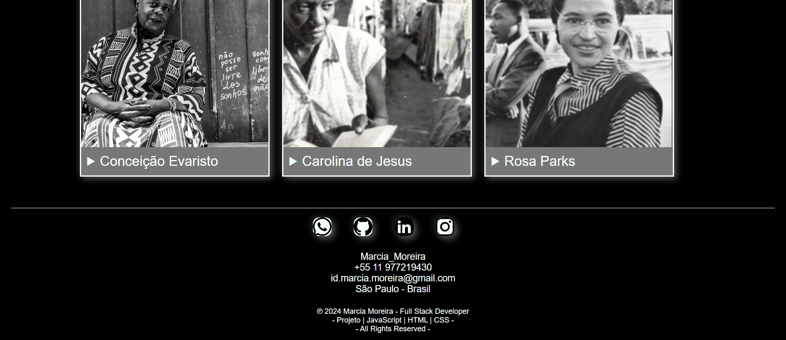

<!-- PrograMaria - 04/2024 -->
<!-- Projeto - Dicionário de Mulheres Negras -->
<!-- Ferramentas - JavaScript | HTML | CSS | Responsividade de Tela -->
<!-- Desenvolvido por - Marcia Moreira -->
<!-- GitHub - https://github.com/Marcia-Moreira -->
<!-- Link do Projeto no GitHub -  -->
<!-- --------------------------------------------------------- -->

# BOOTCAMP Front End - PROGRAMARIA - 04-2024

## Projeto - Dicionário de Mulheres Negras

## Desenvolvido por - Marcia Moreira 

[Me chama no WhatsApp! ](https://wa.me/5511977219430)

## Objetivo do Projeto:

Desenvolver uma página web responsiva às variações de tamanhos de telas de computadores e celulares. 
A página, deverá retornar textos e fotos, posicionadas e ajustadas conforme o tamanho da tela testada.

## Tecnologias e Ferramentas:

- JavaScript
- HTML 5
- CSS 3
- Medias Queries
- Markdown
- Git
- GitHub
- GitHub Pages

## Imagens da Página Web Desenvolvida:

<!-- Teste 1: -->
<!-- |  |  |  |
|:---:|:---:|:---:| -->

<!-- Teste 2: -->

    
    &nbsp;&nbsp;&nbsp;
    
    &nbsp;&nbsp;&nbsp;

    &nbsp;&nbsp;&nbsp;
    
    &nbsp;&nbsp;&nbsp;

## Link do Deploy no GitHub Pages:

[Visite o meu site responsivo!](https://marcia-moreira.github.io/PROGRAMARIA-EuProgrAmo_Site_responsivo)

https://marcia-moreira.github.io/PROGRAMARIA-EuProgrAmo_Site_responsivo

São Paulo - 27-04-2024  

Marcia Moreira
